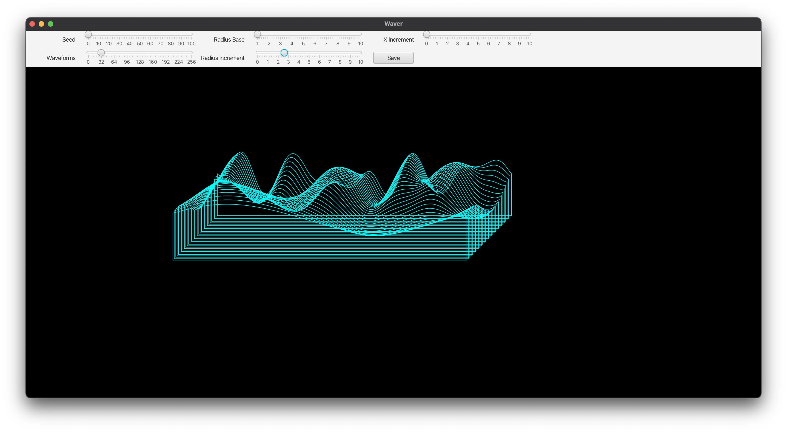

# Waver

This is a program that lets you create wavetables based on a sophisticated type of random number generator.

In this case, the wavetables that are generated are intended to be imported into
Arturia's [Pigments](https://www.arturia.com/products/software-instruments/pigments/overview) software instrument.

## Requirements

* Java Development Kit 21 or later
* Maven

## Building and Running

Run `mvn javafx:run`

1. Use the sliders to modify the wavetable. When you're satisfied, click the Save button and save the file.
2. Go into Pigments, set the Engine type to Wavetable, and click the wavetable name to bring up the wavetable chooser.
3. In the wavetable chooser, click Add Folder and navigate to the folder in which you stored your wavetable.
4. Find your file and load it.

## Disclaimer

I acknowledge that the UI is cluncky. 
I'm more interested in getting the audio files than I am in creating a great user experience.
If anyone cares enough about this I'll gladly accept code contributions!

## Description

A wavetable is a set of audio snippets which are packaged together and intended to be used as a group.

For example, you could have a wavetable containing samples for all the keys on a piano.

Pigments will take a wave file and treat each partition of 2048 bytes as a single waveform,
and then it lets the player transition through the set of waveforms in real time.
Pigments can load wavetables containing as many as 256 waveforms.

This works best if each waveform is similar to its neighbors.
One way to achieve that is by using a technique called [Simplex Noise](https://en.wikipedia.org/wiki/Simplex_noise).
Using that, we can ensure that each waveform itself is somewhat smooth, 
and that there is a smooth transition from each waveform to its neighbor.

N.B. I copied [KdotJPS](https://github.com/KdotJPG/OpenSimplex2)'s implementation, I'm grateful to them for sharing that!

We can think of a wavetable as a 2-dimensional grid. One dimension has a waveform in each row, 
and the other dimension is the set of values that make up one waveform.
The Simplex noise algorithm supports providing a value, given X and Y coordinates.
Changing the value of the coordinates slightly, will return a value that is only a bit different. 
So it's trivial to create a wavetable by iterating over the rows and columns.

But there is a big problem with that approach, when used with Pigments.
The problem is that Pigments loops over each waveform when generating the sounds.
The waveforms produced by this method aren't periodic, they don't start and end with the same values.
That means that high frequency artifacts are heard even when the waveforms look smooth on screen.

One person, Etienne Jacob provided a [very elegant solution](https://bleuje.com/tutorial3/) to this problem.
To get a periodic wave, i.e. one where the beginning and end match up perfectly, one can just
imagine drawing a circle in the 2-dimensional noise space.
Then you traverse the circle, and you end up at the same place you started.

So that's how this works. For each waveform, we traverse a circle through the noise space.
For each subsequent waveform, we change things a little bit to get a different waveform.
There are a few controls that you can use to affect this:

* Seed - The Simplex noise function takes a seed parameter, which you can set. Different values produce different noise landscapes, if you will.
* Radius Base - This is the radius of the circle that we traverse for the first waveform. 
The larger the radius, the more different noise values will appear in the waveform. 
In other words, the larger the radius, the more complex will be the waveform.
* Radius Increment - this is the amount by which the radius will grow for each waveform.
This allows you to create wavetables where the waves transition from simple to complex.
* X Increment - this is the amount by which the centre of the circle shifts for each waveform.
If you increase this value, and set the Radius Increment value to 0, then the waves will all be different
but they will have similar complexity.

Finally, the number of waveforms generated, can be set from 1 to 256. Pigments will do smooth transitions
from one waveform to the next, you do not need to generate large numbers of waveforms to achieve nice effects.

## File Naming

When you save the file, the program suggests a filename with the following format:

`waver-{numberOfWaves}-{radiusBase}-{radiusIncrement}-{xIncrement}-{seed}.wav`

but of course you can specify any filename you like.

